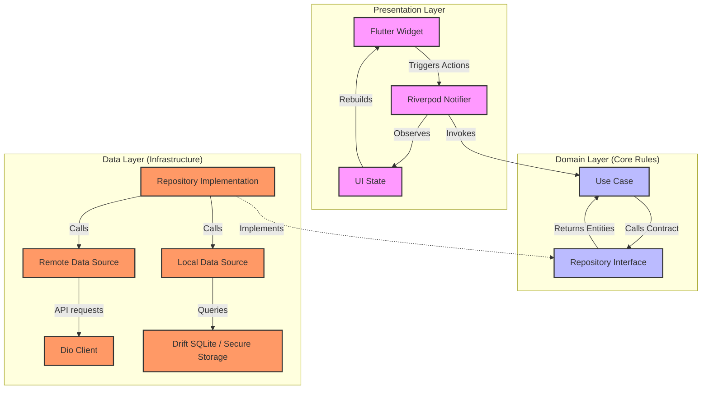
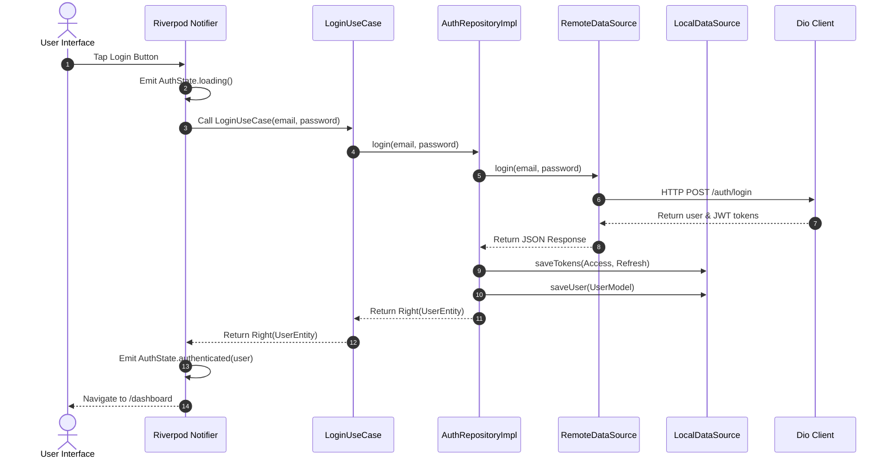
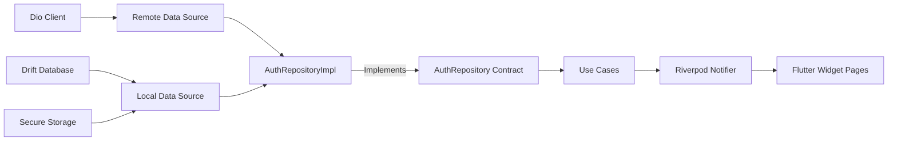
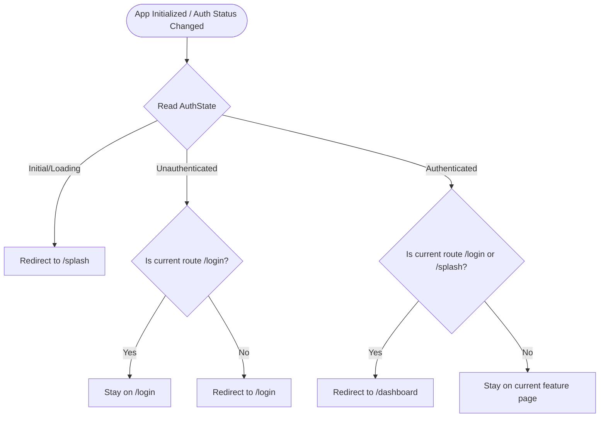
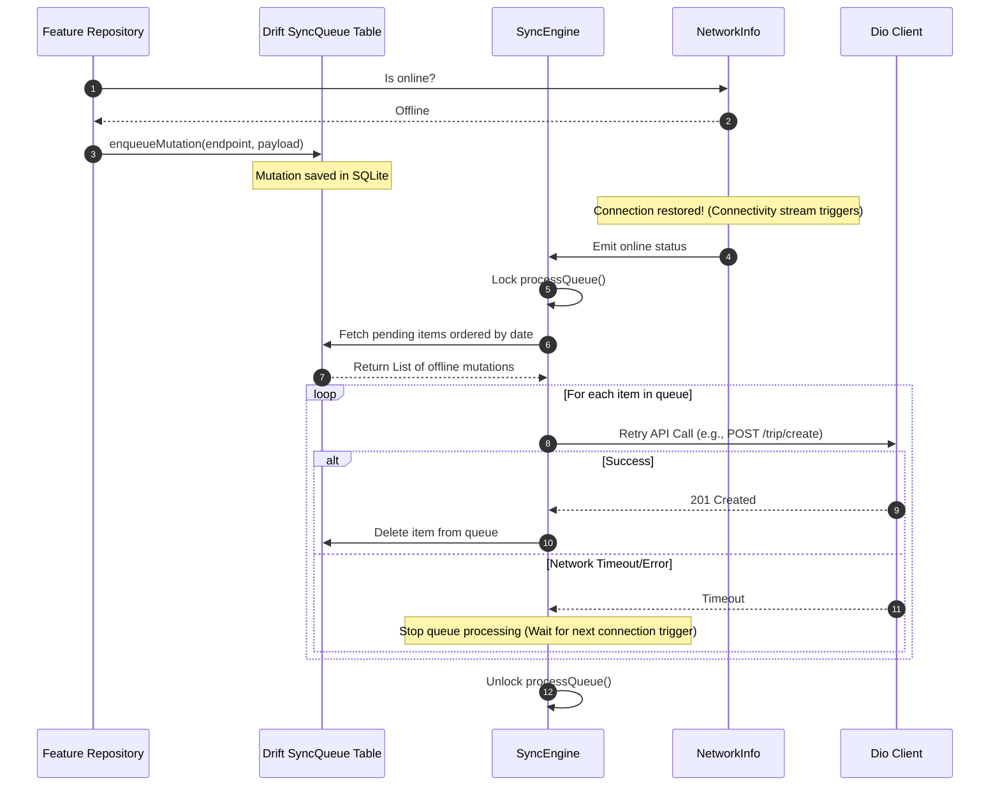

# Enterprise Flutter Architecture Playbook

This playbook defines the architecture, data flow, naming conventions, and best practices for our enterprise-grade Flutter application. It is designed to scale across large development teams and support offline-first operations.

---

## 1. Directory Structure Diagram

Below is the directory layout of the codebase, which follows a **Feature-First** structure mixed with a robust **Core** module for global services.

```text
lib/
├── core/
│   ├── config/                # Environment variables, themes, styles, configurations
│   ├── constants/             # Global system constants (API endpoints, asset keys)
│   ├── database/              # Drift SQLite setup (migrations, connection, schema)
│   │   ├── app_database.dart
│   │   └── sync_engine.dart   # Offline mutation queue scheduler
│   ├── di/                    # Dependency injection registry (GetIt / Injectable)
│   │   ├── injection.dart
│   │   └── register_module.dart
│   ├── error/                 # Failure and Exception types for Result-Either mappings
│   │   ├── exceptions.dart
│   │   └── failures.dart
│   ├── logger/                # Standard app pretty logger, gated by environment
│   │   └── app_logger.dart
│   ├── network/               # Advanced Dio HTTP client & interceptor registry
│   │   ├── dio_client.dart
│   │   ├── auth_event_bus.dart
│   │   ├── network_info.dart
│   │   └── interceptors/      # Auth headers, 401 JWT refreshers, logging
│   ├── routing/               # GoRouter paths, nested ShellRoutes, & navigation guards
│   │   ├── router.dart
│   │   └── router_refresh_stream.dart
│   ├── storage/               # Secured iOS Keychain/Android Keystore & SharedPreferences
│   │   ├── secure_storage_service.dart
│   │   └── preferences_service.dart
│   ├── usecase/               # Base UseCase generic contract
│   │   └── usecase.dart
│   └── widgets/               # Reusable atomic design-system UI widgets
│
├── features/                  # Independent functional verticals
│   ├── auth/                  # Reference Feature: Authentication
│   │   ├── data/
│   │   │   ├── datasources/   # Remote Dio queries and Local database caching
│   │   │   │   ├── auth_local_datasource.dart
│   │   │   │   └── auth_remote_datasource.dart
│   │   │   ├── models/        # DTO models with built-in mapping to Domain
│   │   │   │   └── user_model.dart
│   │   │   └── repositories/  # Implements Domain contract & converts raw exceptions
│   │   │       └── auth_repository_impl.dart
│   │   ├── domain/
│   │   │   ├── entities/      # Immutable, raw domain models representing user entity
│   │   │   │   └── user_entity.dart
│   │   │   ├── repositories/  # Clean abstract interface contract
│   │   │   │   └── auth_repository.dart
│   │   │   └── usecases/      # Single-purpose business rules
│   │   │       ├── get_current_user_usecase.dart
│   │   │       ├── login_usecase.dart
│   │   │       └── logout_usecase.dart
│   │   └── presentation/
│   │       ├── pages/         # High-level screens (Splash, Login)
│   │       ├── providers/     # Riverpod StateNotifier to expose screen states
│   │       │   └── auth_provider.dart
│   │       └── state/         # Freezed union types representing UI state
│   │           └── auth_state.dart
│   │
│   ├── dashboard/             # Bottom-tab Navigation Landing Module
│   └── profile/               # Bottom-tab User Settings Module
│
└── main.dart                  # Application entry-point and dependency pre-resolver
```

---

## 2. Architectural Flow Diagrams

### Architecture Diagram
We follow a strict **Clean Architecture** data flow where the Presentation layer speaks only to Use Cases (Domain), Use Cases fetch data from Repositories (Domain), and Repositories fetch data from Data Sources (Data).



---

### Data Flow Diagram
This shows the sequence when a user triggers an action (e.g., Logging in):



---

### Dependency Flow Diagram
Dependencies are injected outward. The data layer depends on domain interfaces, keeping business rules independent of libraries.



---

### Authentication Guard Flow (GoRouter)
When the application starts or the authentication status updates:



---

### Offline Sync Engine Flow
Our sync engine stores failed network mutations locally in Drift and triggers automatic uploads when connectivity is restored.



---

## 3. Core Network Configuration

Dio is configured with three enterprise interceptors:
1. **AuthInterceptor**: Injects the access token as a header into every request.
2. **RefreshTokenInterceptor**: Catches 401 Unauthorized errors, locks concurrent requests, calls the refresh token endpoint, updates local storage, and retries the original request.
3. **LoggingInterceptor**: Prints pretty logs containing headers, query params, payloads, and response bodies in debug builds.

---

## 4. Coding Guidelines & Naming Conventions

Maintain consistency across features using the following naming standards:

| Layer | Type | File Name Pattern | Class Name Pattern |
| :--- | :--- | :--- | :--- |
| **Domain** | Entity | `[name]_entity.dart` | `[Name]Entity` |
| **Domain** | Repository Contract | `[name]_repository.dart` | `[Name]Repository` |
| **Domain** | Use Case | `[name]_usecase.dart` | `[Name]UseCase` |
| **Data** | Model DTO | `[name]_model.dart` | `[Name]Model` |
| **Data** | Remote Data Source | `[name]_remote_datasource.dart` | `[Name]RemoteDataSourceImpl` |
| **Data** | Local Data Source | `[name]_local_datasource.dart` | `[Name]LocalDataSourceImpl` |
| **Data** | Repository Impl | `[name]_repository_impl.dart` | `[Name]RepositoryImpl` |
| **Presentation** | State Notifier | `[name]_provider.dart` | `[Name]Notifier` |
| **Presentation** | State Union | `[name]_state.dart` | `[Name]State` |
| **Presentation** | Screen/Page | `[name]_page.dart` | `[Name]Page` |

---

## 5. Architectural Do's and Don'ts

### Do's
- **Keep domain layers library-agnostic**: Domain should contain pure Dart logic without imports of database frameworks (Drift, Hive) or network packages (Dio).
- **Use Either / Result pattern**: Avoid throwing errors directly to the UI. Wrap computations in `Either<Failure, Success>` to enforce failure handling.
- **Implement request caching properly**: Make local database sources the single source of truth for presentation state whenever possible.

### Don'ts
- **No Direct Navigation calls**: Never use `Navigator.push` directly in widgets. GoRouter should manage all navigations using GoRouter declarations.
- **No network calls in UI**: Never invoke Dio client methods inside UI pages. All requests must go through a UseCase.
- **Do not bypass Dependency Injection**: Always use GetIt registrations to inject instances. Avoid manually instantiating classes (`final repo = AuthRepositoryImpl()`).

---

## 6. Scalability & Production Best Practices

- **Code Obfuscation**: Always build release versions using `--obfuscate --split-debug-info=...` to secure the binary from reverse-engineering.
- **SSL Pinning**: Bind the server's certificate fingerprint to the Dio Client (using `dio_http_formatter` or custom SecurityContext configurations) to prevent man-in-the-middle (MITM) attacks.
- **Multi-Package Modules**: As the application grows, refactor feature folders into separate local packages (e.g. `packages/core`, `packages/auth`, `packages/dashboard`) within a monorepo setup to decrease compilation times.
- **Drift Background Database**: Native database operations must use background isolates (`NativeDatabase.createInBackground`) to guarantee that disk operations never block the main UI thread.

---

## 7. Environment & Configuration Guide

We use `flutter_dotenv` in combination with compile-time Dart defines to manage environments. 

### Environment Files
The project maintains three config files in the root folder, which are registered as asset files in `pubspec.yaml`:
- `.env.dev`: Local development API endpoints and settings.
- `.env.qa`: Quality Assurance test environment endpoints and settings.
- `.env.prod`: Secure production endpoints and settings.

### Run & Build Commands
To run or build the application for a specific environment, pass the `ENV` parameter using `--dart-define`:

#### Development
```bash
flutter run --dart-define=ENV=dev
```

#### Quality Assurance (QA)
```bash
flutter run --dart-define=ENV=qa
```

#### Production Build
```bash
flutter build apk --release --dart-define=ENV=prod
```

### How it Works
1. At startup, `lib/main.dart` reads the `ENV` string using `const String.fromEnvironment('ENV', defaultValue: 'dev')`.
2. It calls `await dotenv.load(fileName: '.env.$env')` to load the matching asset.
3. The `AppConfig` service (injected as a lazy singleton) parses the keys (e.g., `API_BASE_URL`, `API_TIMEOUT_SECONDS`) into typed getters.
4. `DioClient` reads `appConfig.baseUrl` and `appConfig.timeoutDuration` to configure the base Dio client dynamically.

